# Guía: Creación y Consumo de APIs con HTMX y JavaScript

Esta guía explica paso a paso cómo crear endpoints JSON (APIs internas) en Django y consumirlos desde el frontend
utilizando **HTMX** y **JavaScript**, tomando como referencia la integración entre el formulario de órdenes de compra (
`purchases`) y los datos del proveedor (`suppliers`).

---

## 1. Flujo General de Funcionamiento

El flujo se divide en 3 partes esenciales:

1. **Backend (Django)**: Una vista en `apis.py` que recibe un parámetro por `GET`, consulta la base de datos y responde
   con un `JsonResponse`.
2. **Template (HTML + HTMX)**: Un elemento (ej. `<select>`) configurado con atributos de HTMX para disparar la petición
   HTTP al cambiar su valor, usando `hx-swap="none"` para no modificar el DOM directamente con HTML.
3. **Frontend (JavaScript)**: Un listener del evento global `htmx:afterRequest` que captura la respuesta JSON y asigna
   los datos obtenidos a los campos deseados del formulario.

```mermaid
graph LR
    A[Usuario selecciona opción en <select>] -->|hx-get + hx-trigger| B[Django API Endpoint]
    B -->|JsonResponse con datos| C[HTMX dispara evento htmx:afterRequest]
    C -->|JavaScript parsea JSON| D[Rellena inputs readonly/disabled]
```



---

## 2. Paso 1: Creación del Endpoint API en Django

### A. Vista en `apis.py`

Se crea una función de vista sencilla que obtiene el ID desde `request.GET`, busca el registro y devuelve los campos
requeridos en formato JSON.

```python
# suppliers/apis.py
from django.http import JsonResponse
from django.shortcuts import get_object_or_404
from suppliers.models import Supplier

def api_suppliers_details(request):
    # Obtiene el valor del parámetro enviado en la query string (?supplier=ID)
    pk = request.GET.get('supplier')
    supplier = get_object_or_404(Supplier, id=pk)

    data = {
        'id': supplier.id,
        'name': supplier.name,
        'legal_name': supplier.legal_name,
        'address': supplier.address,
        'city': supplier.city,
        'state_province': supplier.state_province,
        'country': supplier.country.name if supplier.country else '',
        'zip_code': supplier.zip_code,
        'email': supplier.email,
        'contact_name': supplier.contact_name,
        'payment_terms': supplier.payment_terms,
        'currency': supplier.currency.name if supplier.currency else '',
    }

    return JsonResponse(data)
```

### B. Registro de Ruta en `urls.py`

Registramos la ruta asegurando un `app_name` y `name` descriptivo para usarlo con ``:

```python
# suppliers/urls.py
from django.urls import path
from suppliers.apis import api_suppliers_details

app_name = 'suppliers'

urlpatterns = [
    # ... otras URLs ...
    path(
        'api/supplier-details/',
        api_suppliers_details,
        name='supplier_api_details'
    ),
]
```

---

## 3. Paso 2: Renderizado en el Template HTML

### ¿Por qué crearlo manualmente en lugar de usar `{{ form.supplier }}`?

1. **Imposibilidad de usar tags de Django en `forms.py`**: En el formulario de Django (`forms.py`), los widgets se
   configuran en clases de Python donde no tenemos acceso directo al tag de template
   ``.
2. **Separación de responsabilidades**: Las URLs de vistas pertenecen a la capa de rutas/templates, no a la definición
   de tipos de datos del formulario.
3. **Control total de atributos HTML y HTMX**: Renderizar la etiqueta `<select>` a mano permite inyectar fácilmente
   clases de Bootstrap, atributos dinámicos (`hx-get`, `hx-trigger`, `hx-swap`), iterar `form.supplier.field.choices` y
   mantener la compatibilidad con el sistema de validación de Django (`form.supplier.errors`).

### Implementación del HTML:

```html
<div class="col-md-6">
    <label class="form-label fw-bold" for="id_{{ form.supplier.name }}">
        {{ form.supplier.label }}
    </label>
    <select
        name="{{ form.supplier.name }}"
        id="{{ form.supplier.id_for_label }}"
        class="form-select form-select-sm"
        hx-get=""
        hx-trigger="change delay:500ms"
        hx-swap="none"
    >
        
            <option value="{{ value }}" selected>
                {{ label }}
            </option>
        
    </select>
    
        
            <div class="invalid-feedback d-block text-danger">{{ error }}</div>
        
    
</div>
```

---

## 4. Paso 3: Explicación de los Atributos HTMX

| Atributo     | Valor                                          | Explicación                                                                                                                                                                                                                                                   |
|:-------------|:-----------------------------------------------|:--------------------------------------------------------------------------------------------------------------------------------------------------------------------------------------------------------------------------------------------------------------|
| `hx-get`     | `""` | Define la URL a la que HTMX hará la petición GET. HTMX incluye automáticamente el valor actual del `<select>` usando su atributo `name` como clave (`?supplier=<valor_seleccionado>`).                                                                        |
| `hx-trigger` | `"change delay:500ms"`                         | **`change`**: Ejecuta la petición al cambiar la selección.<br>**`delay:500ms`** (Debounce): Espera 500 milisegundos antes de enviar la petición. Si el usuario cambia rápidamente de opción, evita saturar el servidor con múltiples peticiones innecesarias. |
| `hx-swap`    | `"none"`                                       | Le indica a HTMX que **no reemplace ningún elemento del DOM** con la respuesta recibida, ya que la respuesta es JSON y la manipularemos mediante JavaScript.                                                                                                  |

---

## 5. Paso 4: Explicación Detallada del Script JavaScript

Cuando HTMX completa una solicitud, emite eventos en el ciclo de vida del DOM. El evento `htmx:afterRequest` se dispara
inmediatamente después de recibir la respuesta del servidor.

```javascript
document.body.addEventListener('htmx:afterRequest', function (event) {

    // 1. Obtenemos la referencia al elemento que disparó la acción
    const supplier = document.getElementById('id_supplier');

    // 2. Filtro de elemento emisor:
    // Evita que este script se ejecute cuando otras peticiones HTMX en la página terminen.
    // Solo actuamos si la petición provino del select de proveedores.
    if (event.detail.elt !== supplier) {
        return;
    }

    // 3. Validación de estado HTTP:
    // event.detail.successful es true si el status HTTP fue 2xx (ej. 200 OK).
    if (!event.detail.successful) {
        console.error('Error en la petición de la API');
        return;
    }

    // 4. Parseo de la respuesta:
    // La respuesta en texto plano (event.detail.xhr.responseText) se convierte en objeto JSON.
    const data = JSON.parse(event.detail.xhr.responseText);

    // 5. Asignación de valores a los inputs del formulario:
    // Usamos '|| ''' como fallback para evitar que aparezca 'undefined' si un campo viene nulo o vacío.
    document.getElementById('id_supplier_name').value = data.name || '';
    document.getElementById('id_supplier_address').value = data.address || '';
    document.getElementById('id_supplier_city').value = data.city || '';
    document.getElementById('id_supplier_country').value = data.country || '';
});
```

---

## 6. Plantilla Reutilizable para Nuevas APIs

Copia y adapta esta estructura cuando necesites crear otra funcionalidad similar (por ejemplo, autocompletar datos de
Clientes, Materiales, Productos, etc.).

### 1. Backend (`<app>/apis.py` y `<app>/urls.py`)

```python
# <app>/apis.py
from django.http import JsonResponse
from django.shortcuts import get_object_or_404
from <app>.models import TuModelo

def api_tu_modelo_details(request):
    pk = request.GET.get('parametro_id') # o el name de tu campo select
    if not pk:
        return JsonResponse({}, status=400)
    
    instancia = get_object_or_404(TuModelo, id=pk)

    data = {
        'id': instancia.id,
        'campo_1': instancia.campo_1,
        'campo_2': instancia.campo_2,
        'relacion_nombre': instancia.relacion.nombre if instancia.relacion else '',
    }
    return JsonResponse(data)
```

```python
# <app>/urls.py
from django.urls import path
from <app>.apis import api_tu_modelo_details

app_name = 'mi_app'

urlpatterns = [
    path('api/detalles/', api_tu_modelo_details, name='api_detalles'),
]
```

### 2. Frontend Template (`.html`)

```html
<!-- Campo Select Disparador -->
<div class="col-md-6">
    <label class="form-label fw-bold" for="{{ form.mi_campo.id_for_label }}">
        {{ form.mi_campo.label }}
    </label>
    <select
        name="{{ form.mi_campo.name }}"
        id="{{ form.mi_campo.id_for_label }}"
        class="form-select form-select-sm"
        hx-get=""
        hx-trigger="change delay:300ms"
        hx-swap="none"
    >
        
            <option value="{{ value }}">
                {{ label }}
            </option>
        
    </select>
</div>

<!-- Campos Destino que se autocompletarán -->
<div class="col-md-6">
    <input type="text" id="id_campo_1" class="form-control" readonly disabled>
    <input type="text" id="id_campo_2" class="form-control" readonly disabled>
</div>
```

### 3. Frontend Script (``)

```html
<script>
    document.body.addEventListener('htmx:afterRequest', function (event) {
        // Elemento que dispara la petición
        const triggerElement = document.getElementById('id_mi_campo');

        // Validaciones previas
        if (event.detail.elt !== triggerElement || !event.detail.successful) {
            return;
        }

        try {
            const data = JSON.parse(event.detail.xhr.responseText);

            // Mapeo de campos recibidos de la API hacia los IDs del DOM
            const fieldsMap = {
                'id_campo_1': data.campo_1,
                'id_campo_2': data.campo_2,
            };

            // Rellenar automáticamente los inputs
            Object.entries(fieldsMap).forEach(([elementId, value]) => {
                const input = document.getElementById(elementId);
                if (input) {
                    input.value = value || '';
                }
            });
        } catch (error) {
            console.error('Error parseando la respuesta JSON:', error);
        }
    });
</script>
```
